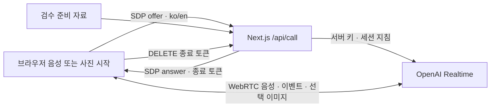

# 구성과 데이터 흐름

**Sites PWA 현재 운영:** 설치·배포 소스, 접근 범위, Workers 통화 종료 계약과 검증은 [Sites PWA](sites-pwa.md)를 우선 따른다. 아래 Next 로컬 서버 기록과 구분한다.

2026-10-08 현재 기본 화면은 `RecyclingCallApp`이다. 설치 없는 한국어·영어 웹에서 말로 물어보기를 누르고 바로 말한다. 사진 찍기·사진 선택으로 시작하면 음성 연결 뒤 사진을 자동 전송한다. 통화 중 카메라와 사진도 선택할 수 있으며 품목 검색·단계별 완료 체크는 요구하지 않는다. 전화번호 기반 전화 연결은 구현하지 않았다.

## 현재 코드 경계

| 파일 | 책임 |
|---|---|
| `src/app/page.tsx` | 기본 통화 화면 진입 |
| `src/components/recycling/RecyclingCallApp.tsx` | 시작·음소거·카메라·사진·종료, 최신 자막과 권한/오류 표시 |
| `src/components/recycling/call-copy.ts` | 한국어·영어 화면과 오류 문구 |
| `src/lib/contracts/call-language.ts` | 지원 언어 검증과 언어별 첫인사 |
| `src/lib/client/recycling-call.ts` | 연결·자동 발화 감지 이벤트·미디어 수명·이미지 전송·취소·늦은 응답 폐기 |
| `src/lib/client/call-images.ts` | 사진 정규화와 데이터 채널용 JPEG 축소 |
| `src/app/api/call/route.ts` | POST 연결과 DELETE 종료 |
| `src/lib/server/recycling-call.ts` | 검수 자료를 포함한 지침, 서버 키로 SDP 교환, 임시 종료 토큰과 타이머 |
| `src/data/preparation-guides.ts` | 기존 quick 자료와 coach 카탈로그에서 조건·준비 방법 구성 |

시작 전 언어 선택은 페이지 메모리에만 두며 연결 중 변경을 잠근다. 서버는 `X-Recycling-Language`의 ko/en만 허용하고 생략 시 ko를 쓴다. 언어는 지역 기준을 바꾸지 않는다. 촬영 입력과 앨범 입력은 별개이며 촬영은 `capture=environment`를 요청한다. 데스크톱에서는 파일 선택기가 열릴 수 있다. 대기 사진은 연결 취소·오류 시 폐기한다.

마이크는 음성 시작 또는 사진 선택 완료 뒤 권한 허용 후 열며 통화 중 자동 발화 감지·응답·끼어들기를 사용한다. 카메라는 기본으로 꺼져 있다. 켠 동안 약 3초마다, 발화 경계에서도 JPEG 정지 화면을 보낸다. 연속 동영상 전송은 아니다. 최근 두 이미지 항목을 유지하며 사진 전송 시 카메라를 끈다.

서버는 통화 종료용 토큰·종료 함수·타이머를 임시 메모리에 둔다. DB나 대화 이력 저장소는 없다. 최대 두 활성 통화, 통화당 10분 제한이다. 종료·이탈·실패 시 브라우저 트랙과 연결을 닫고 서버 종료도 요청한다. 프로세스 재시작 시 메모리 매핑은 소실된다.

## 판단과 신뢰 경계

기본 통화 모델은 `gpt-realtime-2.1-mini`, 선택 언어의 입력 전사는 `gpt-transcribe`, 목소리는 `marin`이다. 검수 자료·불명 조건·위험물 제한을 서버 지침에 넣지만 답변은 실시간 생성된다. 기존 coach의 문장 일치 검증이나 규칙 선택기가 각 발화를 검증하는 구조는 아니다. 지침 준수를 정확도 보장으로 표현하지 않는다.

검수 범위는 송파구 일상 13범주와 공식 수거·문의 4범주다. 기준 원본과 출처를 재사용하며 요청 중 공식 사이트를 검색하지 않는다. 앱은 사용자 음성·사진·자막을 영구 보관하지 않지만 외부 제공자의 처리·보관까지 없다는 의미는 아니다.

## 보존한 기존 경로

`PhotoCoachApp`/`PhotoRecyclingCoach`, `/api/coach/recognize`, `/help`, `/speech`, `/api/identify`, `/api/analyze`는 기본 화면과 분리된 기존 소비자다. 별도 공개 페이지로 노출한 것은 아니다. 사진·실물 ID·단계별 선택 이력·부품 결과·검수 문장 WAV 계약을 유지한다. `PreparationSummary`는 체크 없는 준비 안내를 위한 이전 소비자다. 기존 API의 수동 인식 계약이 남아 있어도 기본 UI에 직접 품목 찾기를 다시 넣지 않는다.

기존 coach는 `gpt-6-luna`로 사진/도움 후보를 받고 서버가 검수 자료와 대조한다. speech 경로는 요청별 Realtime 연결의 텍스트를 허용 문장과 대조한 뒤 WAV를 반환한다. 이 보장을 기본 통화에 옮겨 적지 않는다.

휴대폰 사용에는 신뢰된 HTTPS와 실제 권한·오디오 검증이 필요하다. [운영](operations.md), [계약](contracts.md), [검증 기록](verification.md), [다음 세션 인수인계](tracking/handoff.md)를 따른다.
